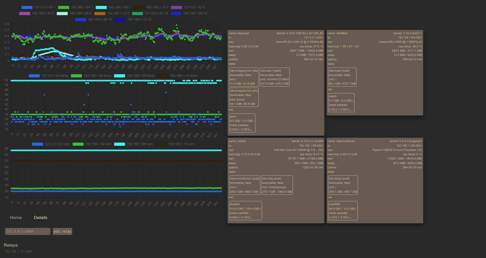
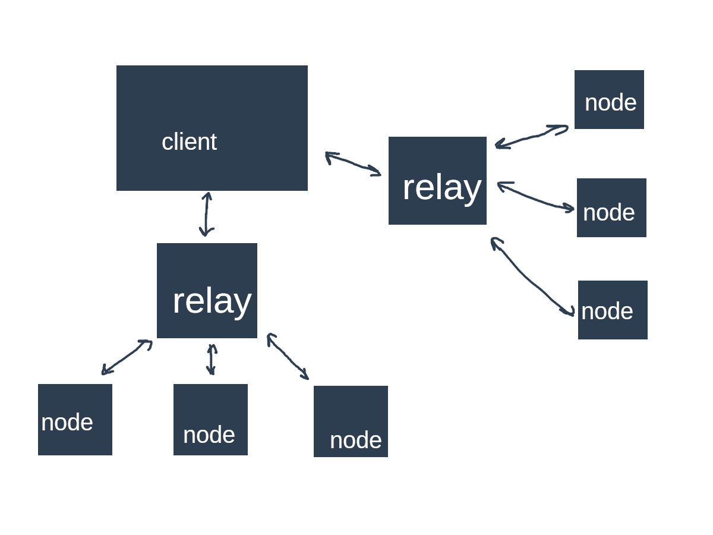

<h3 align="center">
	 
	server-dashboard
	 
</h3>

dashboard to display server information

	

Live updating dashboard in Vuejs. The graphs shown are created with chartjs. I have a few home servers and knowing some info on them at a glance instead of sshing into each of them would be nice. I created this dashboard to show data from the past hour at intervals every 10 seconds. The backend REST API is written in Rust while the Vue frontend communicates with it.

#### Preview:

	

#### structure:

The way the client is connected to the different relays and nodes are shown below. The reason why there is a relay in the first place is that is where the data is cached in memory for an hour, it is also intended to have a relay per a local network in order to expose only 1 port. The client stores the relay addresses in browser localstorage as it's very simple and doesn't require you to have any sort of accounts/sync mechanism.

	

#### Todo:
* update color scheme - at the time I was using gruvbox but it looks a bit flat
* potentially add authentication on the relays
* Add a details page to show more info about the systems as a table instead of a box with readouts
* Add releases on GitHub to make setting this up easier
